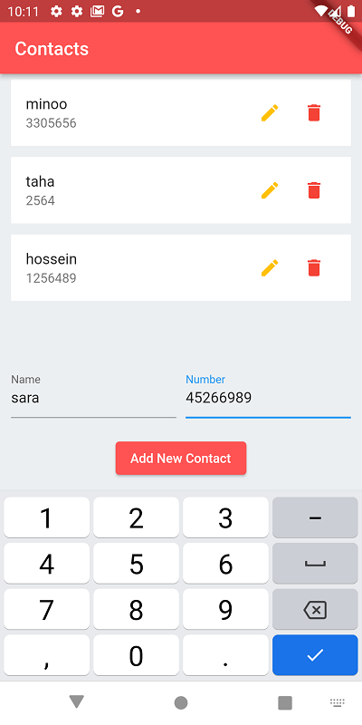

# flutter_contact_app_with_getx_and_hive

A new Flutter app that uses GetX for State Manager and Hive as a local NoSQL Database project.
All of CRUD operations are considered in this simple contact app example using Hive fast local database

## Demo Pics of App:

  

  =============================================================================================

  

